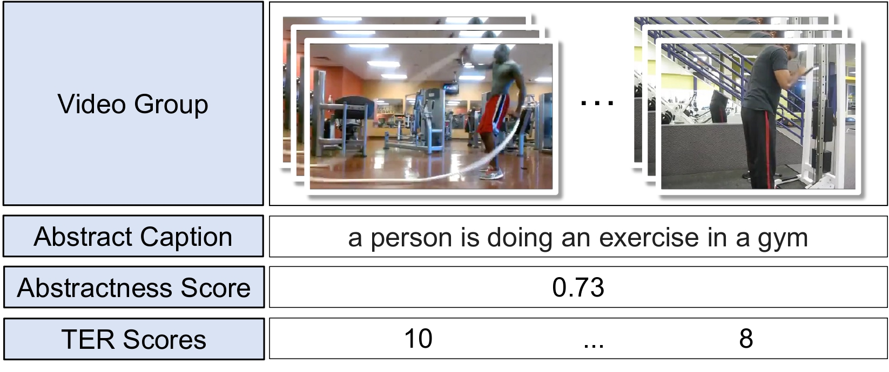
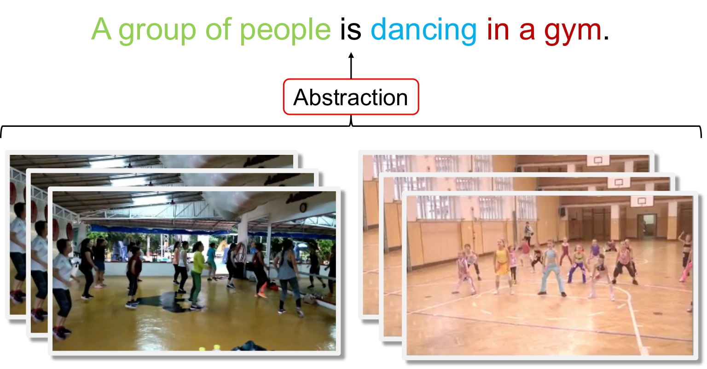

AbstrActs is a benchmark dataset for abstractive multi-video captioning introduced in the paper "Abstractive Multi-Video Captioning: Benchmark Dataset Construction and Extensive Evaluation."



Abstractive multi-video captioning is the task that models describe information shared by multiple videos as much as possible.  
In order to solve this task, models need to not only understand each video in detail but also have strong abstraction abilities to find commonalities among videos.  
Codes for our experiments are available at https://github.com/ku-nlp/Abstractive-Multi-Video-Captioning




# JSONL Data Sample
```
{
    "caption":"a person is using a sewing machine",
    "abstractness":0.62,
    "videos":[
        {
            "video_id":"Rdp4C01AKwE_000037_000047",
            "ter_score":7
        },
        {
            "video_id":"7T5nKVJrP5U_000120_000130",
            "ter_score":2
        }
    ]
}
```

# Downloadable Features
VATEX video features (CLIP4Clip):  
https://lotus.kuee.kyoto-u.ac.jp/~r-takahashi/dataset/VATEX_CLIP4Clip.zip

VATEX caption features (fasttext):  
https://lotus.kuee.kyoto-u.ac.jp/~r-takahashi/dataset/VATEX_caption_features.zip

# Citation
If you find this dataset helpful, please cite our publication.

```
Rikito Takahashi, Hirokazu Kiyomaru, Chenhui Chu, Sadao Kurohashi.
Abstractive Multi-Video Captioning: Benchmark Dataset Construction and Extensive Evaluation.
In Proceedings of the 2024 Joint International Conference on Computational Linguistics, Language Resources and Evaluation (LREC-COLING), (2024.5).
```

# Acknowledgements
This work was supported by JSPS KAKENHI Grant Number JP23H03454 and Fujitsu.
